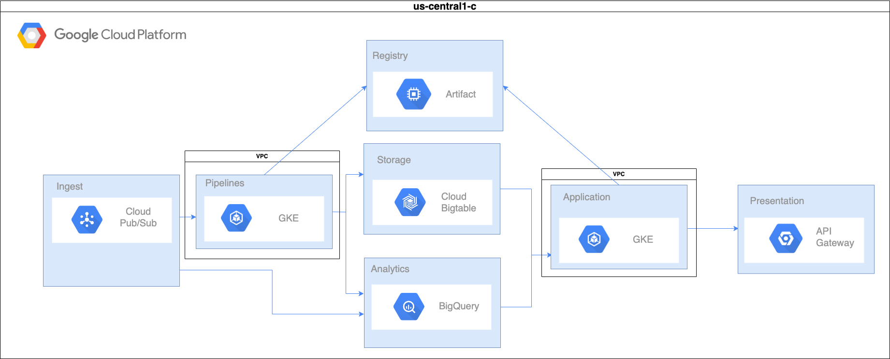

# LATAM Challenge

## Context 
- Data ingestion and storage using advance analytic.
- Expose HTTP API to be consumed.

## Objectives
- Develop a cloud system to ingest, store and expose data, using IaC, deploying CI/CD flows. Develop quality tests, monitoring, alerts to ensure the system is working properly.

## Architecture

The proposal architecture try to be the simplest and easiest to scale. It's using a Pub/Sub component who is in charged to handle the requests and put in the right subscriptions and topics, allowing us to process all the data whiteout losing any. Also give us the possibility to create and organize the data in different topics and subscriptions helping us to scale with order if it's necessary. 

Once the data is in the subscription we have a microservice ([pubsubapp](./pubsubapp/README.md)) that is in charged to pull the data and store it in the right tables. This microservice is living in a Kubernetes cluster inside one VPC to add an extra layer of security. The processed data will be stored in Cloud Table because it's designed to process high volumes of data, create datasets and tables to organize our input data and has the advantage to BigQuery for analytic purposes. 

In the presentation layer we have a microservice ([app](./app/README.md)) who is in charged to retrieve data from BigTable and show the information via HTTP. To manage our APIs, define policies for publications and usage restrictions for our microservices. We are using API Gateway to easily do all these operations through it central interface.

##### Next Steps

1. Implement in a real scenario.
2. Discuss volume and traffic expected. 
3. Use policies to define control access.
4. Budget expectations. 

#### Part 1: [IaC Infraestructure](./infra/README.md)

#### Part 2: Applications and CI/CD flows

- [pubsub README](./pubsubapp/README.md)
- [app README](./app/README.md)

#### Part 3: [Integration test and quality control](./scripts/README.md)

#### Part 4: Metrics and monitoring

Having an effective monitoring system collects data, aggregates it, stores it, visualizes metrics, and alerts you about any current and future problem in your systems. When you select the right tool you avoid inconsistency, misleading information and waste of time.

DataDog is an easy tool to implement in most of the cloud solutions, and easy to manage and create new boards using Terraform. Having the control with terraform allow us to avoid duplication, easy to deploy and scale.

With DataDog we can create the following monitors and read the following metrics: 

1. Networking monitor
    1. Packet lost
    2. Availability 
    3. Throughput 
    4. Connectivity

2. Data Monitor 
    1. Ingestion rate
    2. Failure Detection
    3. Error rate 
    4. Request rate
    5. Average response

3. Application Monitor
    1. CPU
    2. Memory
    3. Disk Usage
    4. Number of nodes
    5. Number of pods
    6. Service Failures and restarts
    7. Execution time
    8. Request rate
    9. Average response time

##### DataDog Implementation

Using the infra repository previously defined and the terraform pipeline described in [IaC Infraestructure](./infra/README.md) we are able to create our DataDog implementation. 

##### Next Steps

1. Create terraform scaffolding.
2. Create GitHub workflow to execute DataDog terraform.
2. Terraform monitors. 

#### Parte 5: Alertas y SRE (Opcional)

Defining service level indicators without knowing the volume, usage, requirements, how critical is the data, and the expectations is quite difficult but based on different books, papers and experience. I can propose the following  

- Users want to have access to their data as soon as possible, ensuring the ingestion latency is behind 50 milliseconds. Makes the user feel comfortable and confident with the process and the system.

- Having a system who works smoothly creates engagement and less frustration. Having an early failure detection and right metrics brings the possibility to identify the root cause easily. Defining 10 errors per request in a minute give us enough time to analyze our metrics, logs and give us the right time to tackle the problem easily.

- Analyzing data fast and precise is one of our main concerns. It’s necessary to have a low batch throughput in less than 50 milliseconds to keep the flow of the process straightforward.

- An application capable of display the results fast, simple and with fewer downtimes generates thrust. Monitoring the traffic, and compute resources (CPU / Memory) are quite important metrics that we need to have in place. To achieve it the right auto-scaling rules must be set in a 60%, giving enough time to the system to scale and if something is not working properly have the flexibility to step in and correct it.

SLOs
- Ensuring our data is ingested and processed in less than 50 milliseconds gives us a time response of our application less than .1 seconds. That is the average amount of time that the users cannot experience interruptions.
- Having the right metrics and monitoring tools give us the ability to analyze and find improvement areas and being able to have a 95% performance over the year.

##### Next Steps

1. Based in the SLAs, SLIs and SLOs and the monitoring tools, we can start creating an [alert system with DataDog](https://docs.datadoghq.com/monitors/), sending mails, slack mesasages, etc .... 
