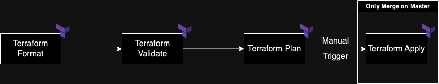

# LATAM Challenge Infraestructure

Having a defined methodology to create and maintain your infrastructure is an important piece for every company. Having in mind this we propose the following pipeline, builted in GitHub Actions.



## Pipeline Phases

1. Terraform Format - Format all the files before to be merged
1. Terraform Validate - Validate structure and syntax is correct
1. Terraform Plan - Plan that the creation of the resources
1. Terraform Apply - Create the infrastructure planned before/

## Infraestructure Folder Structure

```
└── infra
    ├── README.md       
    ├── apigateway                      # Contains all Terraform variables
    │   ├── backend.tfvars              # Contains Terraform state configurat
    │   └── terraform.tfvars            # Contaions GCP credentials, region and zone
    ├── terraform                       # Contains the Terraform Resource/Module files
    │   ├── apigateway                  # Resource Folder
    │   │   ├── backend.tf              # Terraform configuration
    │   │   ├── main.tf                 # Terraform resources
    │   │   ├── outputs.tf              # Terraform output
    │   │   ├── provider.tf             # Terraform provider
    │   │   └── variables.tf            # Terraform variables
```

## How to add a new resource

1.  Create a new Terraform `variables` and `resource` folder With the name of your new resources.

```sh
export InfraResourceName=<ResourceName>
mkdir infra/$InfraResourceName
mkdir infra/terraform/$InfraResourceName
```

2. Create the `backend.tfvars` and `terraform.tfvars` inside `variables` folder previously created.

```sh
touch infra/$InfraResourceName/backend.tfvars infra/$InfraResourceName/terraform.tfvars
```

3. Add the following configuration to the `variables` files created 
    
    1. `backend.tfvars`.

    ```
    bucket = "<Terraform state bucket name>"
    ```

    2. `terraform.tfvars`.

    ```
    project = "<GCP project name>"
    region = "<GCP region>"
    zone    = "<GCP zone>"
    credentials_path = "<Path to GCP credentials>"
    ```

4. Create the `backend.tf`, `main.tf`, `outputs.tf`, `provider.tf` and `variables.tf` inside `resource` folder previously created.

```sh
touch infra/terraform/$InfraResourceName/backend.tf infra/terraform/$InfraResourceName/main.tf infra/terraform/$InfraResourceName/outputs.tf infra/terraform/$InfraResourceName/provider.tf infra/terraform/$InfraResourceName/variables.tf
```

5. Add the following configuration to the `resource` files created 

    1. `backend.tf`.

    ```
    terraform {
      required_providers {
        google = {
          source = "hashicorp/google"
          version = "4.51.0"
        }
      }

      backend "gcs" {
        bucket  = var.bucket
        prefix  = "terraform/state"
      }
    }
    ```

    2. `provider.tf`.

    ```
    provider "google-beta" {
        project = var.project
        region = var.region
        zone = var.zone
        credentials = file(var.credentials_path)
    }
    ```

    3. `variables.tf`

    ```
    variable "project" {}

    variable "region" {}

    variable "zone" {}

    variable "credentials_path" {}
    ```

    > Note: You can add variables on demand in this file.

    
    4. `outputs.tf`

        > Note: You can add outputs in this file.

    5. `variables.tf`

        > Note: You can add your resources in this file.

6. How to test it locally

    1. Format the repository

    ```sh
    terraform fmt --recursive
    ```


    2. Change to the `resource` Directory
    
    ```sh
    cd infra/terraform/$InfraResourceName
    ```

    3. Terraform init
    
    ```sh
    terraform init -get=true -force-copy -backend-config=../../$InfraResourceName/backend.tfvars
    ```

    4. Terraform plan
        
    ```sh
    terraform plan -var-file=../../$InfraResourceName/terraform.tfvars     
    ```

    5. Terraform apply
    ```sh
    terraform apply -var-file=../../$InfraResourceName/terraform.tfvars     
    ```

7. Happy Terraformig !!

## Next Steps

1. Create Global Workflow repo with the Terraform pipeline to have a generic file, improving agility in the creation of new users.
2. Use artifacts to store the planning and ensure that the planning generated will be applied.
3. Create two set of credentials for the workflows:
    
    1. First credentials (plan), has a restriction policy to just plan the infrastructure.
    2. Second credentials (plan), has no restrictions' policy to create the infrastructure.

1. Create a script in charged to create the scaffolding for a new resource.
2. Create a folder structure for different environments, regions and zones.

```
└── infra
    ├── README.md       
    ├── apigateway
    │   ├── nonprod
    │   │   ├── asia-east1-a
    │   │   │   ├── backend.tfvars
    │   │   │   └── terraform.tfvars
    |   │   └── northamerica-northeast1-c
    │   │       ├── backend.tfvars
    │   │       └── terraform.tfvars
    |   └── prod
    │       ├── asia-east1-a
    │       │   ├── backend.tfvars
    │       │   └── terraform.tfvars
    |       └── northamerica-northeast1-c
    │           ├── backend.tfvars
    │           └── terraform.tfvars  
```


## Resources

[1] [GCP Teeraform good practices](https://cloud.google.com/docs/terraform/best-practices-for-terraform)

[2] [Terraform GCP Resources](https://registry.terraform.io/providers/hashicorp/google/latest/docs)

[3] [GitHub Action Documentation](https://docs.github.com/en/actions)