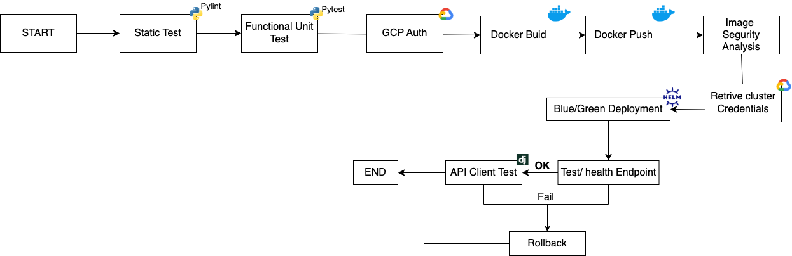

# Testing the app

Building and deploying code efficiently is extremely important. Automation reduces human errors. The following flow is in charged to deploy the code, ensuring the quality and reducing the risk of bring bugs to the existing code. 

1. <b>Static Test</b> - Examine the code without execution.
2. <b>Functional Unit Test</b> - Ensure that the overall of the application is working.
3. <b>GCP Auth</b> - Auth to GCP
4. <b>Docker build</b> - Install all the required dependencies and add the right files inside the container.
5. <b>Docker push</b> - Add the image to the Artifact registry.
6. <b>Retrieve Cluster Credentials</b> - Add Kubernetes context.
7. <b>Blue/Green Deployment</b> - Help us to have a 0 downtime.
8. <b>Test `/health` endpoint</b> - Check that the pods were up and running.
9. API Client Test - Runs a bench test in all the endpoints, ensuring the service fulfill all the standards.
10. Rollback - If the step 8 and 9 are not fulfilled 

##### Next Steps

1. Implement statistic test to the pipeline.
2. Implement functional unit test to the pipeline. 
3. Add a monitoring tool, who checks periodically that the system is up and running is an important part of the development.
